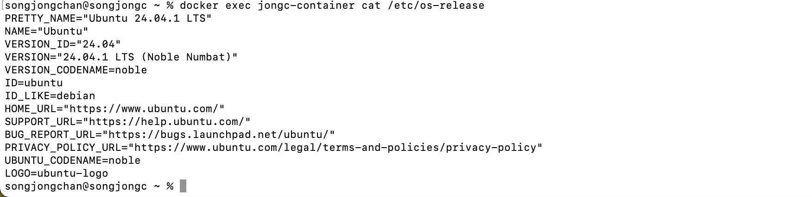
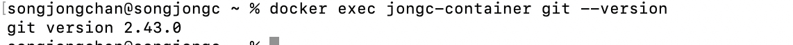
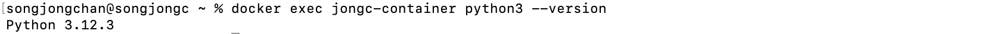
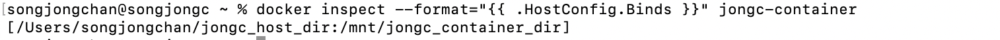

# SWE_2021_41_2024_2_week_6

## Week 4 Assignment 
* Link of your repository

~~~python
def isHappy(n):
  #완료조건은 길이가 1일 때 까지
  #토큰값이 1이면 true
  #같은 값이 한번이라도 다시 나오면(무한루프) false

  sum = n # 새로운 n
  current = 0
  record = {sum} # 중복 검사를 위한 set

  while 1:
    digits = [int(digit) for digit in str(sum)] # 한자리수로 치환
    sum = 0
    for digit in digits:
      sum += digit*digit

    #제곱합이 1이면 true
    if sum == 1:
      return True
    #이미 존재하면 false
    if sum in record:
      return False
    #둘다 아니면 다시
    record.add(sum)

print(isHappy(19)) #True
print(isHappy(2)) #False
print(isHappy(7))
~~~

* Description of your code
  - 코드에 설명되어있듯이
    * 성공 조건은 sum값이 1이 나왔을 때
    * 실패 조건은 같은 값이 중복으로 나왔을 때(무한루프)
  
  - line 6\~8: 루프 연산을 위해 sum값을 파라미터로 받은 n값으로 초기화하고, current는 알고리즘을 바꾸는 과정에서 실수로 삭제하지 못한 변수, record는 연산의 결과를 삽입하는데, 중복을 방지하기 위해 자료형을 set으로 지정
  - line 10\~14: 숫자 sum을 문자열로 변환해서 숫자 하나씩 토큰화, 토큰화한 문자열 형태의 숫자를 다시 정수 형태로 digits 리스트에 삽입함. 이후 각 정수를 곱하는 연산을 하고, 다시 sum의 값으로 대입함.
  - line 16\~23: 연산한 sum의 결과에 따라 1이면 True, 중복이면 False, 둘 다 아니면 루프를 다시 실행
  - line 25\~27: 결과를 출력
---
## Week 5 Assignment
> <pre> <code>docker exec jongc-container cat /etc/os-release</code> </pre>
>   * jongc-container라는 이름의 Docker 컨테이너 내에서 운영 체제 정보를 확인하고 그대로 출력시키는 명령어
>   

> <pre> <code>docker exec jongc-container git --version </code></pre>
>   * jongc-container내에 설치된 git 버전을 출력시키는 명령어
>   

> <pre> <code>docker exec jongc-container python3 --version </code></pre>
>   * jongc-container내에 설치된 python3 버전을 출력시키는 명령어\
>   

> <pre> <code>docker inspect --format="{{ .HostConfig.Binds }}" jongc-container </code></pre>
>   * 컨테이너와 호스트 시스템 간의 파일 시스템 바인딩(연결) 정보를 확인\
>   
